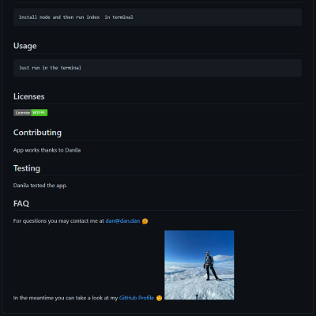

# ReadmeGenerator

#### Description

```
Radme generator for github projects.
```

## Table of Contents:

- [Title](#ReadmeGenerator)
  - [Description](#description)
- [Installation Instructions](#installation%20instructions)
- [Usage](#usage)
  - [Screenshot](#screenshot)
  - [Video](#video)
- [Licenses](#licenses)
- [Contributing](#contributing)
- [Testing](#testing)
- [FAQ](#faq)

## Installation Instructions

```
Run index.js through Node.js
```

## Usage

```
To properly use this generator through console/terminal you must have Node.js installed. Then simply run index.js and follow prompts.
```

#### Screenshot



#### Video


https://user-images.githubusercontent.com/57278348/155059201-c27a62ef-0c0f-449e-8933-10b5928695d1.mp4


## Licenses

[](http://creativecommons.org/publicdomain/zero/1.0/)<br/>,[](https://firstdonoharm.dev)<br/>,[](http://unlicense.org/)<br/>,[](http://www.wtfpl.net/about/)<br/>

## Contributing

App works thanks to Danila Popov

## Testing

Danila tested the app.

## FAQ

For questions you may contact me at [danila.vpopov@gmail.com](danila.vpopov@gmail.com) :thinking:

In the meantime you can take a look at my [GitHub Profile](https://github.com/corhydare) :smirk:
[](https://github.com/corhydare)
